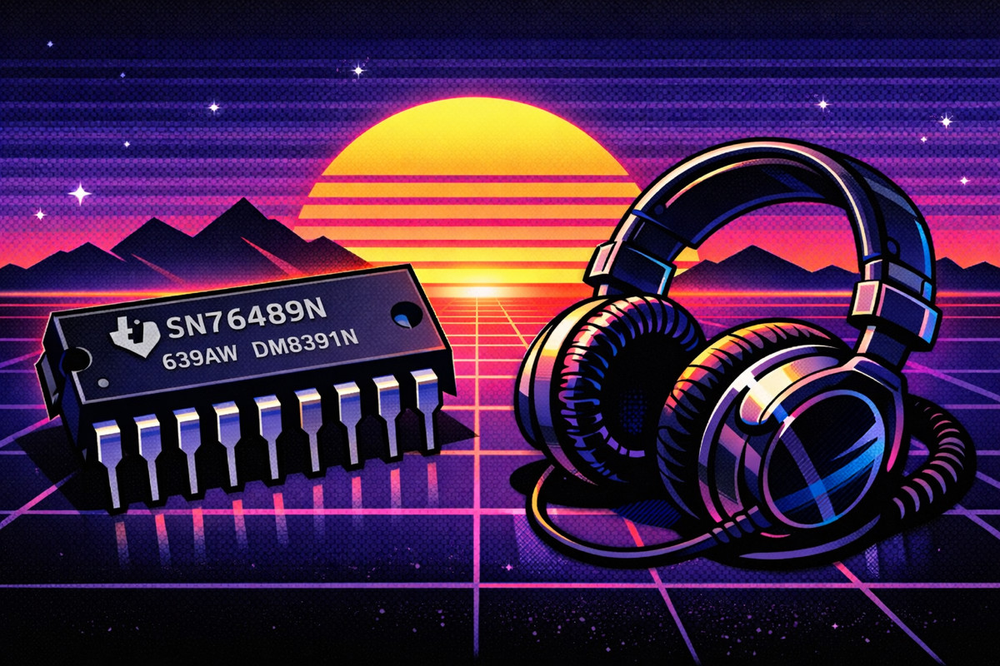
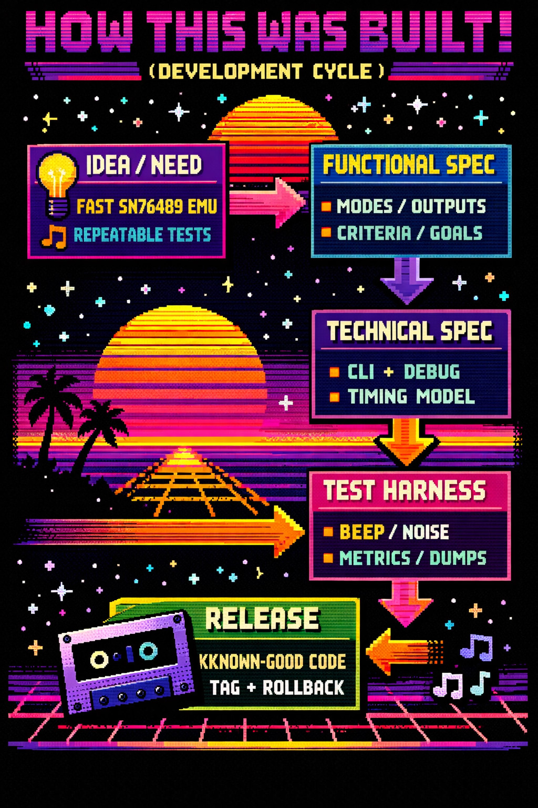
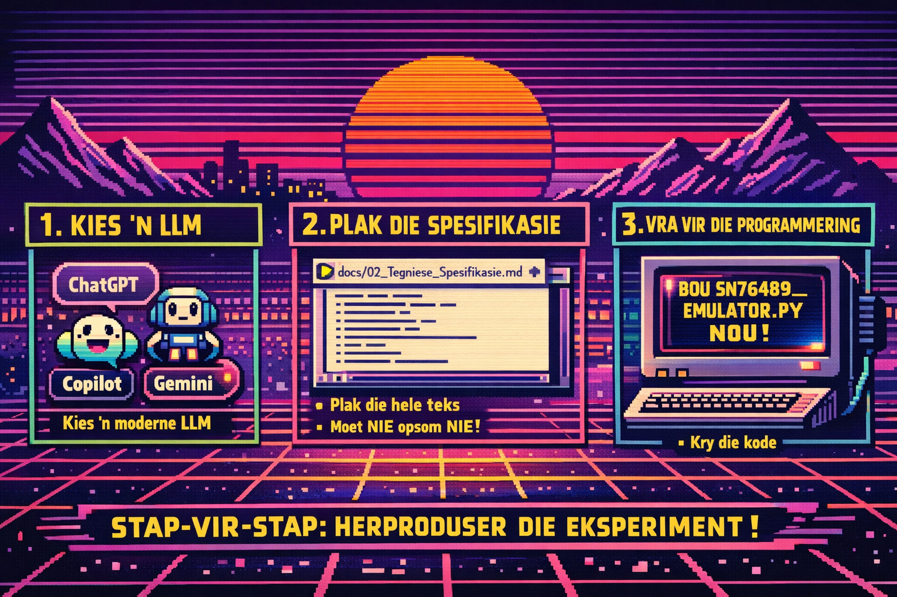

# HOWTO — Build a Complex Emulator with (Almost) Zero Coding

## Executive summary

This document demonstrates that a **non-trivial Python application** — in this case a full SN76489 sound chip emulator — can be built **purely from structured text**, without writing code by hand.

No Python knowledge is required to follow the process.



The key is not “AI magic”, but **disciplined specification**:
- clear functional intent
- explicit technical contracts
- deterministic tests
- controlled iteration

Large Language Models (LLMs) are used **only** as implementation accelerators.

---

## What was built

A fully working **SN76489 PSG emulator** in Python, featuring:
- audio output
- MIDI input
- VGM file playback
- deterministic debug & regression tooling

All functionality lives in **one Python file** and runs on macOS.

Public release: **v0.06**  
Repository:  
https://github.com/pappavis/SN76489_emulator

---

## Audience

This HOWTO is intended for:
- ***engineers*** curious about AI-assisted development
- technical managers evaluating LLM productivity claims
- architects interested in specification-first workflows
- hardware/software ***hobbyists*** validating emulation concepts

No Python knowledge is required to follow the process.

---

## The core idea

> If you can describe a system precisely enough,  
> an AI can implement it — even if you cannot code.

The quality of the output is directly proportional to:
- the quality of the specifications
- the clarity of constraints
- the strictness of acceptance criteria

---

## Step-by-step: reproduce the experiment

### 1. Choose an LLM
Open any modern LLM, for example:
- ChatGPT
- GitHub Copilot Chat
- Google Gemini

### 2. Provide the technical contract
Copy-paste the full contents of:
<a href="./docs/02 Technische specs.md" target="./blank">docs/02_Technical_Specification.md</a> into the chat window.

Do **not** summarize it.  
Do **not** paraphrase it.

### 3. Request implementation

After pasting, enter:
```bash
Build sn76489_emulator.py immediately, exactly according to this specification.
```

Wait for the code to be generated.

### 4. Run the result
- Install Python (free, from python.org)
- Install dependencies as instructed
- Run the generated script

If the specification was followed correctly:
- audio will play
- tests will pass
- debug output will match the contract

---

## Development cycle (real timeline)

This project was completed in **one evening**:

- **Start:** 2-Feb-2026, 17:30  
  Initial idea + first functional description

- **Iteration:**  
  Functional Specs → Technical Specs → Tests → Corrections

- **Public release:** 2-Feb-2026, 22:00  
  Version v0.06 (VGM playback, MIDI, full debug contracts)

Total elapsed time: **~5 hours**



---

## Why this matters

This experiment shows that:
- LLMs do not replace engineering thinking
- They amplify **well-structured reasoning**
- Poor specs lead to poor code, regardless of AI

In other words:
> The bottleneck is no longer typing speed —  
> it is clarity of thought.

---

## Key takeaways

- Text **is** an executable artifact when structured correctly
- Specifications are more valuable than code
- AI works best when treated as a compiler, not an author
- Rollback, tests and determinism still matter

---

## What this is *not*

- Not a claim that “anyone can code anything instantly”
- Not a replacement for engineering judgement
- Not an endorsement of unreviewed AI output

Human intent remains the controlling factor.

---

## Next directions

Possible follow-ups include:
- expanding the specification to new features
- comparing multiple AI implementations against the same spec
- applying the method to non-audio domains
- bridging the emulator to real SN76489 hardware

See the main repository <a href="./docs/quick_setup_install.md">README</a> for the current roadmap.




# Credits
 - Idea, execution: Michiel Erasmus

